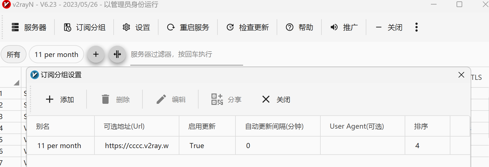
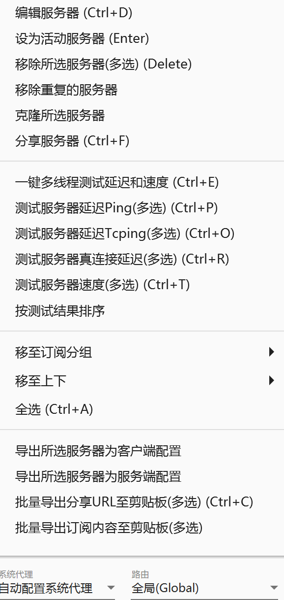

# 5分钟教你使用V2rayN科学上网

### 萌萌哒mmd

#### 1. 下载V2rayN

官方链接[GitHub - 2dust/v2rayN: A GUI client for Windows, support Xray core and v2fly core and others](https://github.com/2dust/v2rayN)

个人链接：https://rec.ustc.edu.cn/share/2ceb2130-693b-11ef-9464-f58d7b99b00f

密码：ly382965

#### 2. 节点购买网站

网络上有大量的节点购买网站，价格不一，也存在免费节点，经过个人实践，免费节点并不好用，该网站 https://jxdy.top/ 较为便宜（19元110G/39元240G）推荐使用。

#### 3. 简单教程：

（1）解压并打开V2rayN，点击订阅分组-订阅分组设置-添加，粘贴节点购买网站提供的url（别名无需理会，随便写个即可），点击订阅分组-更新全部订阅更新节点。

​	（2）右键节点即可对该节点进行测速，测试延迟，设置为活动服务器等。右下方可以更改系统代理和路由。选择“自动配置系统代理”和“全局/绕过大陆”即可科学上网。

下面是一些废话，来源于[Clash中文教程网](https://clashv2ray.com/20035.html)

## 什么是v2ray和v2rayN?

*v2ray*是一款功能强大的开源科学上网工具,基于 VMess 协议,提供多种代理方式,包括 Socks、HTTP、HTTPS 等,能够帮助用户突破网络限制,访问被屏蔽的网站和资源。

*v2rayN*是 v2ray 在Windows平台上的图形化客户端,提供了友好的操作界面和丰富的功能,使用起来更加方便和直观。v2rayN 集成了 v2ray 的核心功能,并提供了订阅管理、服务器选择、代理模式切换等功能。

## v2ray和v2rayN的优势

*v2ray和 v2rayN的主要优势包括 :*

- **多协议支持**: 支持 VMess、VLESS、Trojan、Shadowsocks 等多种代理协议,满足不同用户的需求。
- **低延迟和高速度**: 采用先进的传输技术,能够提供较低的延迟和较高的网速,为用户带来流畅的上网体验。
- **安全性强**: 采用加密传输,抵御网络监测和封锁,保护用户的上网隐私。
- **跨平台支持**: v2ray和v2rayN支持Windows、macOS、Linux等多个操作系统,可满足不同用户的需求。
- **免费开源**: v2ray和v2rayN均为开源免费软件,无需付费即可使用。
